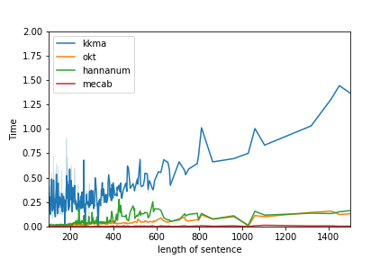

## Preprocessing  

- make_dic_seq.py  		
	- making dictionary  
	- making sequence idx

## 형태소 분석기 성능  

## word frequency

'Josa','Suffix','Foreign','Punctuation' 제거 후 vocab size 28730에서 28101으로 줄어들었다.  

## word2vec 결과  
embedding된 vector에 대해서 cosine similarity로 유사도를 구해보면 아래와 같다.

## TODO

1. komoran  
2. BPE 추가
3. doc2vec 추가  
4. dataset 추가
5. negative sampling 추가  
6. pca 분석