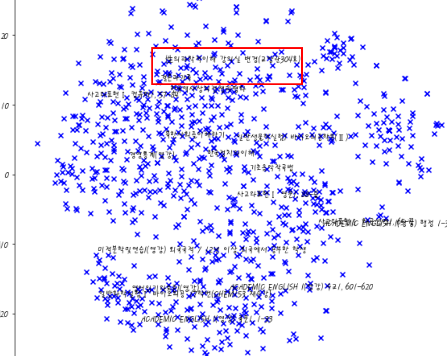

## keyword 추출 후 tf_idf 기반으로 추천

- Data tree  
```
data-------prep   (klue_preprocess_keyword.py로 전처리한 파일이 저장될 경로)
       |---raw    (전처리 전 원본 파일 경로)
```

- Execution  

```
python klue_preprocess_keyword.py --dir C:\\tensor_code\\kluebot\\data --keyword 1

keyword 1: '' 2:'과제' 3:'출석' 4:'선수'

python apply_tfidf.py --dir C:\\tensor_code\\kluebot\\data\\prep\\2017_1_1 --classtype 교양

```  

## tf-idf 시각화



